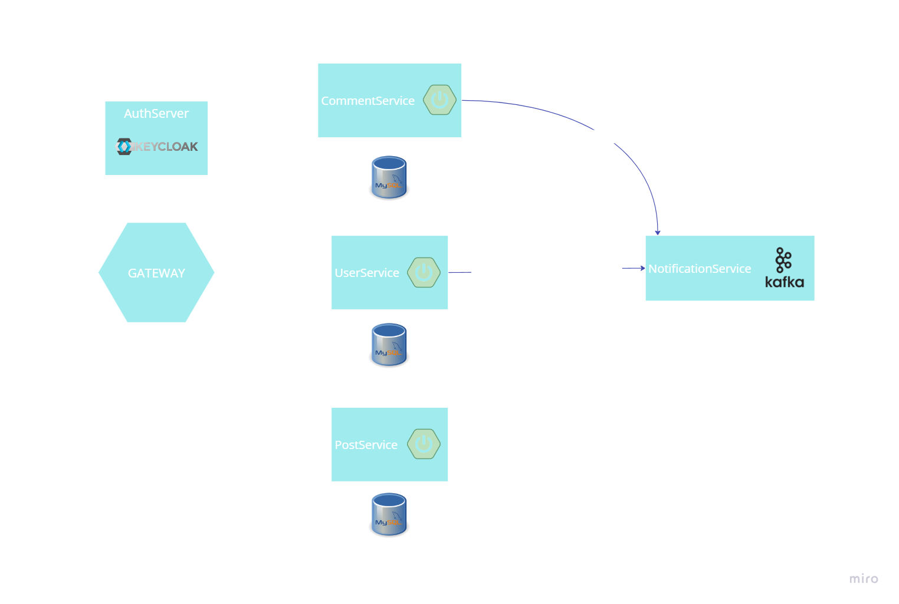

# Social Media App with Microservices Architecture

---
## Overview

### Where users can:
- Register via oauth2 and manage their accounts.
- Create posts.
- Like and comment on posts.
- Receive asynchronous  email notifications for relevant activities through the notification service, implemented with Apache Kafka.
## Features
- **User Management:** Users can register, log in, and update their profiles preferences.
- **Security:** The application integrates Keycloak for secure authentication and authorization across all services.
- **Post Creation:** Users can create posts with others. 
- **Interactions:** Like and comment on posts to engage with content.
- **Notification Service:** Sends email notifications for important events.

## Technologies Used
- Java with Spring boot
- Docker to containerize the application and SQL database
- Spring Security
- Keycloak server 
- Apache kafka
---
## API Endpoints

### User Authentication Controller

**Base URL:** `/user-auth`

| HTTP Method | Endpoint         | Description                        | Request Body/Parameters                 | Response                |
|-------------|------------------|------------------------------------|-----------------------------------------|-------------------------|
| POST        | `/add`           | Registers a new user.              | `UserDto` in the request body           | `201 Created` or `500 Internal Server Error`. |
| POST        | `/edit`          | Edits an existing user.            | `UserDto` in the request body           | Success message or error details. |
| POST        | `/update`        | Updates an existing user.          | `UserDto` in the request body           | Success message or `404 Not Found`. |
| DELETE      | `/delete/{id}`   | Deletes a user by their ID.        | `id` as a path variable                 | Success message.        |
| PATCH       | `/changePassword` | Changes the user's password.       | `ChangePassword` in the request body    | Success message or empty response. |
| GET         | `/getUser/{id}`  | Retrieves a user by their ID.      | `id` as a path variable                 | `UserIdDto` object.     |

---

### Preference Controller

**Base URL:** `/preferences`

| HTTP Method | Endpoint                              | Description                                       | Request Body/Parameters                 | Response                |
|-------------|---------------------------------------|---------------------------------------------------|-----------------------------------------|-------------------------|
| GET         | `/{id}`                               | Retrieves preference settings by ID.             | `id` as a path variable                 | `Preference` object.    |
| PUT         | `/updateLanguage`                    | Updates the preferred language for the user.     | `ChangeLanguage` in the request body    | `202 Accepted`.         |
| PUT         | `/updateNotification/{id}/{status}`  | Updates the notification settings for the user.  | `id` and `NotificationStatus` as path variables | `202 Accepted`. |

---
## API Endpoints

### Blog Post Controller

**Base URL:** `/blogPost`

| HTTP Method | Endpoint                  | Description                                | Request Body/Parameters            | Response                              |
|-------------|---------------------------|--------------------------------------------|------------------------------------|---------------------------------------|
| POST        | `/addPost`                | Creates a new blog post. Requires authorization. | `PostDto` in the request body     | No content.                          |
| GET         | `/`                       | Retrieves a list of all blog posts.         | None                               | List of `PostDto` objects.           |
| GET         | `/{postId}`               | Retrieves a blog post by its ID.            | `postId` as a path variable        | `PostDto` object.                    |
| DELETE      | `/{postId}`               | Deletes a blog post by its ID.              | `postId` as a path variable        | No content.                          |
| GET         | `/user/{userId}`          | Retrieves all blog posts created by a user. | `userId` as a path variable        | List of `PostDto` objects.           |

---

### Like Controller

**Base URL:** `/likes`

| HTTP Method | Endpoint                        | Description                                           | Request Body/Parameters                     | Response                        |
|-------------|---------------------------------|-------------------------------------------------------|---------------------------------------------|---------------------------------|
| GET         | `/getAll/{postId}`              | Retrieves the total number of likes on a post.        | `postId` as a path variable                 | Total count of likes (integer). |
| GET         | `/isLiked/{userId}/{postId}`    | Checks if a user has liked a specific post.           | `userId` and `postId` as path variables     | Boolean (`true` or `false`).    |
| POST        | `/add/{userId}/{postId}`        | Adds a like to a post for a specific user. Requires authorization. | `userId` and `postId` as path variables | `BlogPost` object representing the liked post. |
| GET         | `/delete/{userId}/{postId}`     | Deletes a like from a post for a specific user.       | `userId` and `postId` as path variables     | No content.                     |
| GET         | `/delete/{postId}`              | Deletes all likes associated with a specific post.    | `postId` as a path variable                 | No content.                     |

---
### Comment Controller
**Base URL:** `/comment`

| HTTP Method | Endpoint                   | Description                                           | Request Body/Parameters             | Response                           |
|-------------|----------------------------|-------------------------------------------------------|--------------------------------------|------------------------------------|
| **POST**    | `/add`                     | Adds a new comment to a post. Requires authorization. | `CommentDTO` in the request body:   `{ "postId": Long, "userId": Long, "content": String }` | No content.                       |
| **GET**     | `/count/{postId}`          | Retrieves the total number of comments for a post.    | `postId` as a path variable          | Number of comments (`Long`).      |
| **GET**     | `/comments/{postId}`       | Retrieves all comments for a post.                   | `postId` as a path variable          | List of `Comment` objects:   `[ { "commentId": Long, "postId": Long, "userId": Long, "content": String, "timestamp": String }, ... ]` |
| **DELETE**  | `/delete/{commentId}`      | Deletes a specific comment by its ID.                | `commentId` as a path variable       | No content.                       |
| **DELETE**  | `/deleteAll/{postId}`      | Deletes all comments associated with a post.         | `postId` as a path variable          | No content.                       |

---
